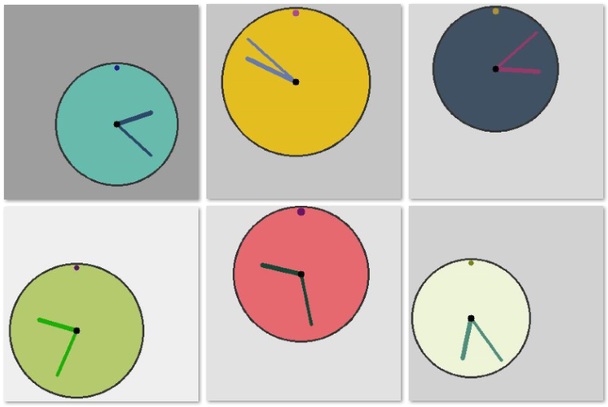

# 作业3：时钟时间识别

## 一、作业内容

- 数据集中包含50000幅如图所示的时钟图像，图像大小为$300\times 300$像素。每幅图像对应一个表示时间的标签，例如`4,2`表示4:02，`9,44`表示9:44。

    

- 试构建机器学习模型，输入时钟图像，识别出其中的时间。
- 数据集
  - `images`文件夹中是5000幅时间图像。
  - `label.csv`文件中是图像对应的标签。其中，第`1`行数据表示`0.jpg`中的时间，第`2`行数据表示`1.jpg`中的时间。
  - 参见：https://www.kaggle.com/datasets/shivajbd/analog-clocks

## 二、要求

1. 本次作业选择，可作为课程大作业。

